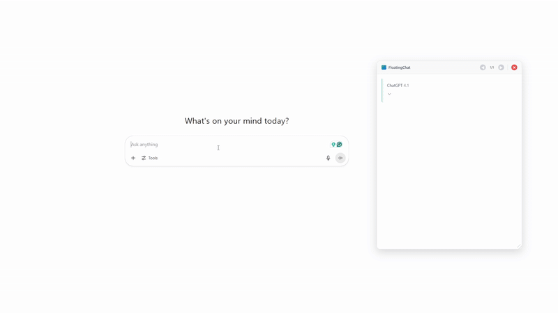

# FloatingChat - AI History Navigator

A Chrome extension that adds floating windows to AI chat platforms, allowing you to navigate through your conversation history without scrolling.

## What it does

FloatingChat creates a floating window that captures questions and answers from your AI conversations. Instead of scrolling up through long chats to find previous responses, you can use navigation buttons to browse through your Q&A history.

**Supported platforms:**
- ChatGPT (chatgpt.com)
- Claude (claude.ai) 
- Gemini (gemini.google.com)
- DeepSeek (chat.deepseek.com)

## Features

- Stores Q&A pairs in a floating window during your chat session
- Navigate through conversation history with previous/next buttons
- Floating window can be moved and resized
- Remembers window position and size
- Works with dark and light themes

## Installation

1. Clone this repository
2. Open Chrome and go to `chrome://extensions/`
3. Enable "Developer mode"
4. Click "Load unpacked" and select the FloatingChat folder
5. Visit any supported AI platform and start a conversation

## Usage

1. Install the extension and visit a supported AI platform
2. Click the FloatingChat icon in your toolbar to enable it
3. Start asking questions - responses will appear in the floating window
4. Use the ← → buttons to navigate through your conversation history
5. Drag the window to move it, or resize from the corner

## Technical Details

- **Files**: Content script, background script, popup interface, CSS styles
- **Permissions**: Active tab access, storage for settings
- **Storage**: Uses Chrome sync storage for window preferences
- **Performance**: Lightweight DOM observation with minimal overhead

## Contributing

Bug reports and feature requests are welcome. If you want to contribute code:

1. Fork the repository
2. Create a feature branch
3. Test your changes on all supported platforms
4. Submit a pull request with a clear description

## Version History

**1.0.0** - Initial release with history navigation, multi-platform support, and floating window management

## License

MIT License - see LICENSE file for details

## Contact

- Author: Simon Zeng
- Email: simon7108528@gmail.com
- GitHub: [@SimonZeng7108](https://github.com/SimonZeng7108) 